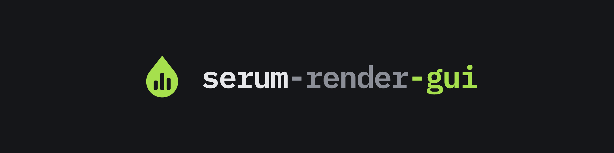
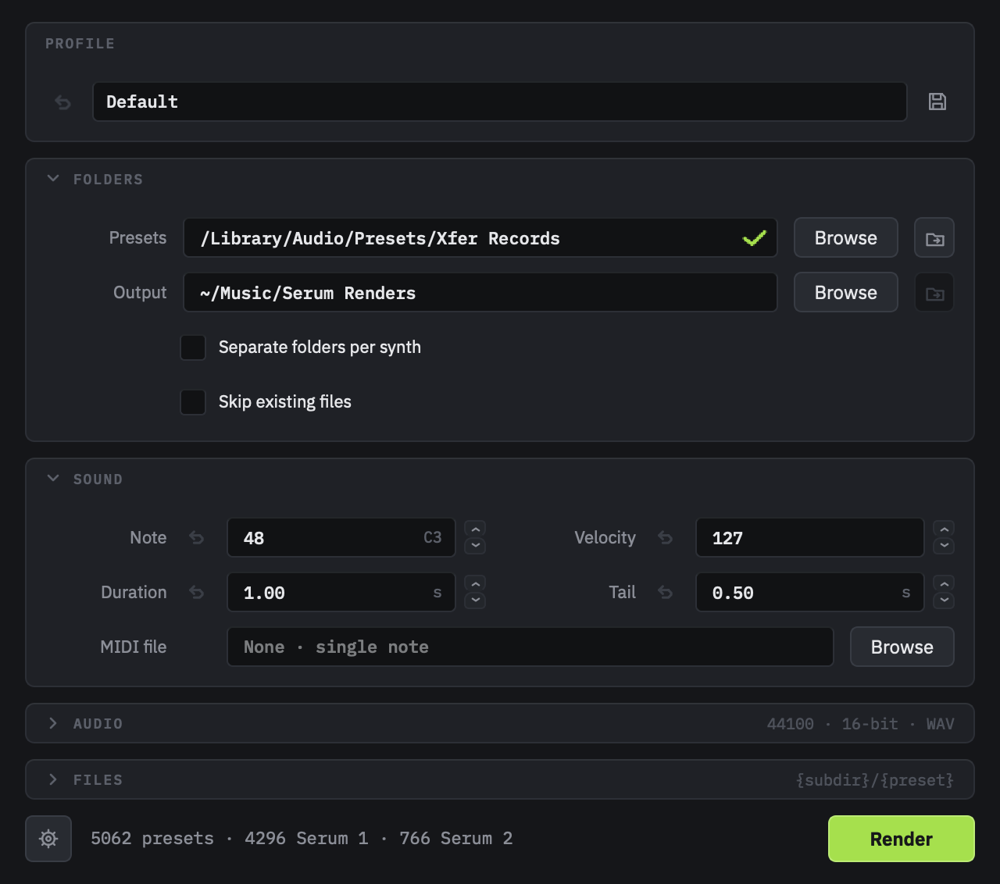

<p align="center">
  
</p>

Desktop front end for [serum-render](https://github.com/wiillownet/serum-render):
batch-render Serum 1 (`.fxp`) and Serum 2 (`.SerumPreset`) presets to audio
without retyping a 25-flag command. Point it at a preset library, pick a note
and a length, press Render.

<p align="center">
  
</p>

## What it does

- **Plans as you type.** Preset counts, which synth each needs, how many
  outputs already exist and any filename collisions update on every change,
  before anything renders.
- **Resumes and retries.** Skip existing files to pick a stopped batch back up.
  Failures get their own list and a Retry that re-runs exactly the settings
  the batch used.
- **Profiles.** Save a set of sound, audio and filename settings under a name.
  Modified fields show what they will revert to.
- **WAV, FLAC, OGG Vorbis or NPY**, 16, 24 or 32-bit float where the format
  allows it, any sample rate, single note or a MIDI file.
- **Filename templates** with `{preset}`, `{subdir}`, `{folder}`, `{format}`,
  `{note}` and `{velocity}`, previewed live.
- **A log window** (View > Log) for the launch command, every preset as it
  starts and finishes, and the renderer's stderr.

## Requirements

- macOS, Windows or Linux with Python 3.11 or 3.12
- Serum 1 and/or Serum 2 installed

## Install

```bash
python -m venv .venv
.venv/bin/pip install -e .
.venv/bin/serum-render-gui
```

On first launch the setup sheet detects the plugins and the Xfer preset
folder; confirm them and choose an output folder.

## How it works

The GUI never renders in its own process. Rendering runs as
`python -m serum_render ... --json` in a child process group, and its NDJSON
event stream drives the progress bar, the failure list and the log.

Planning stays in-process: discovery, counting and collision detection re-run
continuously as you type, which a subprocess per keystroke could not do. That
path imports only serum-render's discovery layer and never loads a plugin.

## Development

```bash
.venv/bin/pytest tests/ -q
```

Tests run against Qt's offscreen platform and need no plugins.

## Licence

GPL-3.0-or-later, matching serum-render. PySide6 is used under the LGPL.
